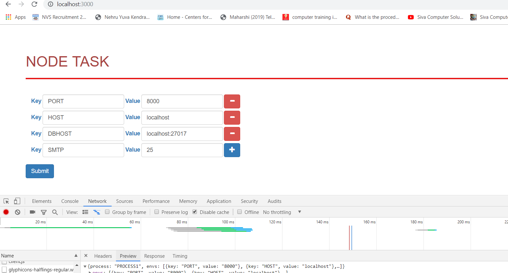
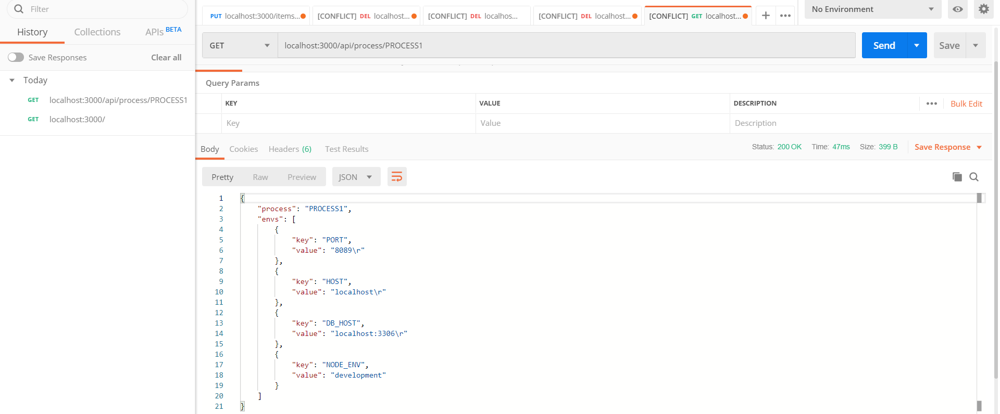
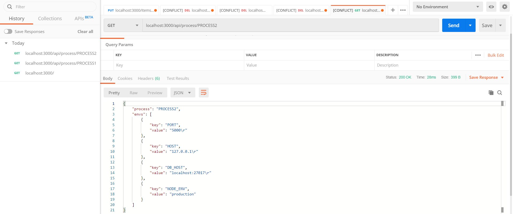
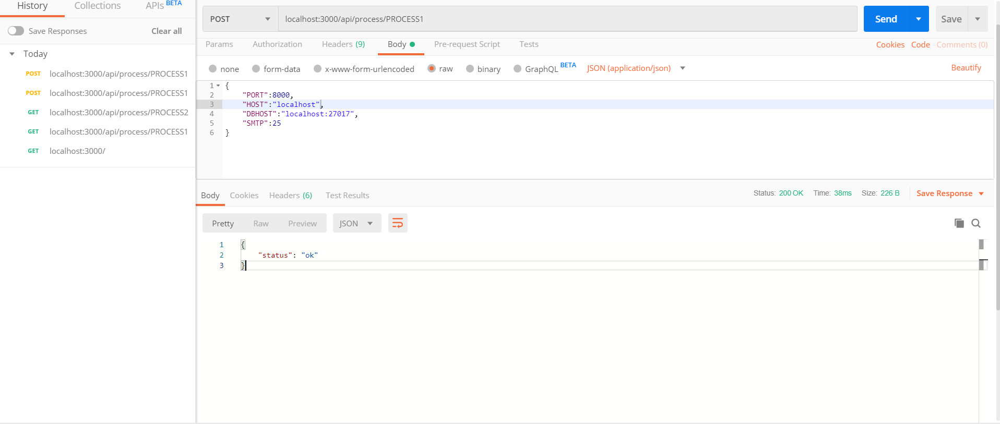

## Node Task

### Objective

- Develop an API to get and Set the environment variables in different processes

### Setup and Run

- Clone the repo
- Install the dependencies `npm install`
- Start the app `npm start`

###  Sample UI



### Testing an API using POSTMAN

- Get env varaibles by process name
  ```
  http://localhost:3000/api/process/Process1
  ```
  

  ```
  http://localhost:3000/api/process/Process2
  ```  
  

- Set Environment variables in process 
  ```
  http://localhost:3000/api/process/Process1
  { key1: value1, key2:value2, key3:value3 ....}
  ```
  


